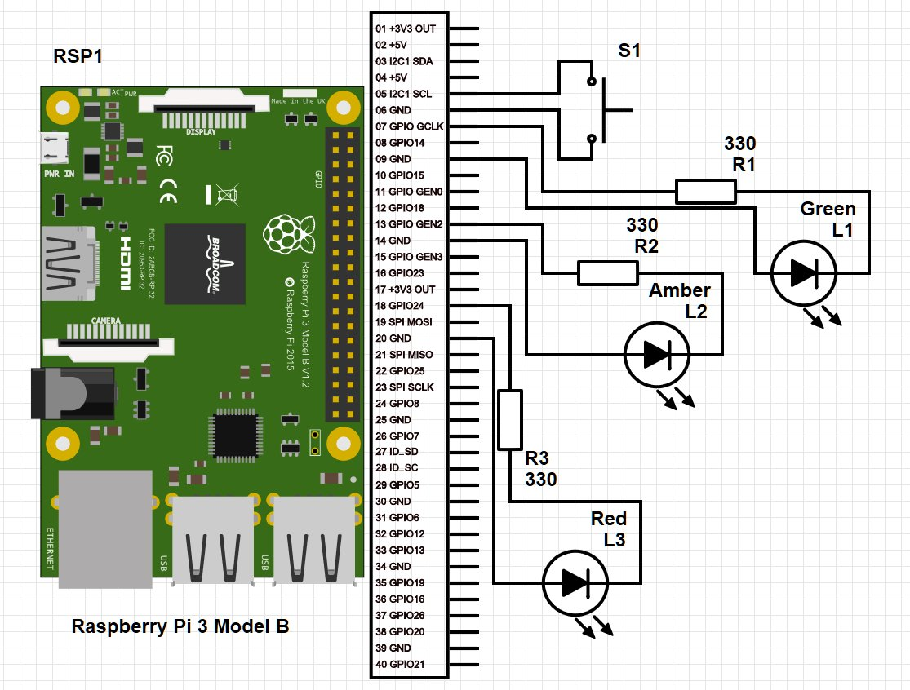

# pi-power-button

Fork from the "Pi power button guide" - this also adds flashing lights on powerup and shutdown (as well as a power light)

Modified scripts based on the [Pi power button guide](https://howchoo.com/g/mwnlytk3zmm/how-to-add-a-power-button-to-your-raspberry-pi) on howchoo.

## Layout

Breadboard implementation, showing both the on/off switch as well as the "traffic light" set of lights

You may need to up the resistor for R1 to 1K depending on how much power your Pi is drawing



## Installation

### Pre-installation

fbi, Linux framebuffer imageviewer, is a prerequisite so that images can be displayed on the Linux command line.

**This can be installed using the following commands :**

```
sudo apt-get update
sudo apt-get -y install fbi
```
### Installation of the script:

1. Clone down this repo to your Raspberry Pi
2. Run `script/install`

## RGB LED option:

It can also work using an RGB LED to produce the same results as using 3 LEDs.

### Installation of the script:

1. Clone down this repo to your Raspberry Pi
2. Run `script/rgbinstall`

That's it!

